# Power BI Hands-on training 

<br />

### **INDEX**

- [CSV ファイルからデータを読み込み](#csv-ファイルからデータを読み込み)

- [テーブルの追加](#テーブルの追加)

- [メジャーの追加 (1)](#メジャーの追加-1)

- [カードの追加](#カードの追加)

- [円グラフの追加](#円グラフの追加)

- [ツリー マップの追加](#ツリー-マップの追加)

- [マトリックスの追加 (1)](#マトリックスの追加-1)

- [メジャーの追加 (2)](#メジャーの追加-2)

- [マトリックスの更新 (1)](#マトリックスの更新-1)

- [メジャーの追加 (3)](#メジャーの追加-3)

- [マトリックスの更新 (2)](#マトリックスの更新-2)

- [メジャーの追加 (4)](#メジャーの追加-4)

- [マトリックスの追加 (2)](#マトリックスの追加-2)

<br />

## はじめてのレポート作成

### CSV ファイルからデータを読み込み

- Power BI Desktop を起動

- 「**データを取得**」をクリックし、「**テキスト/CSV**」をクリック

  

- 「**顧客.csv**」を選択し、「**開く**」をクリック

- **元のファイル**、**区切り記号**、**データ型検出** を設定し、「**読み込み**」をクリック

  - **元のファイル**： 65001: Unicode (UTF-8)

  - **区切り記号**： コンマ

  - **データ型検出**： 最初の 200 行に基づく

    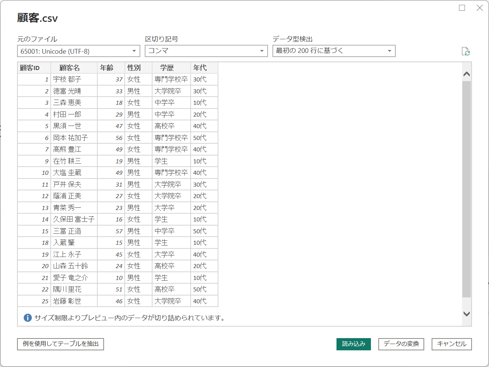

- フィールド リストに「**顧客**」が追加

  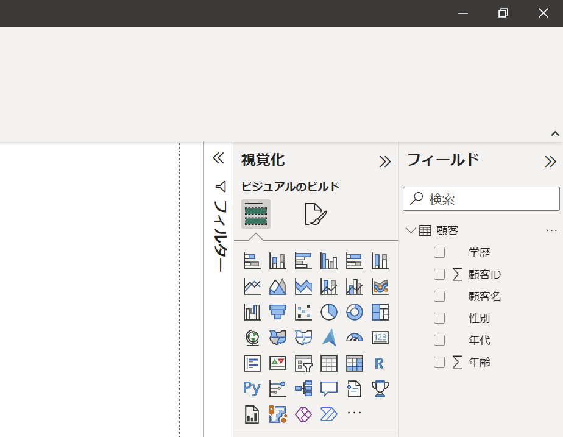

<br />

### テーブルの追加

- 「**視覚化**」の「**テーブル**」をクリック

  

- フィールド リストの「**顧客**」の「**顧客名**」、「**性別**」、「**学歴**」、「**年代**」を選択

  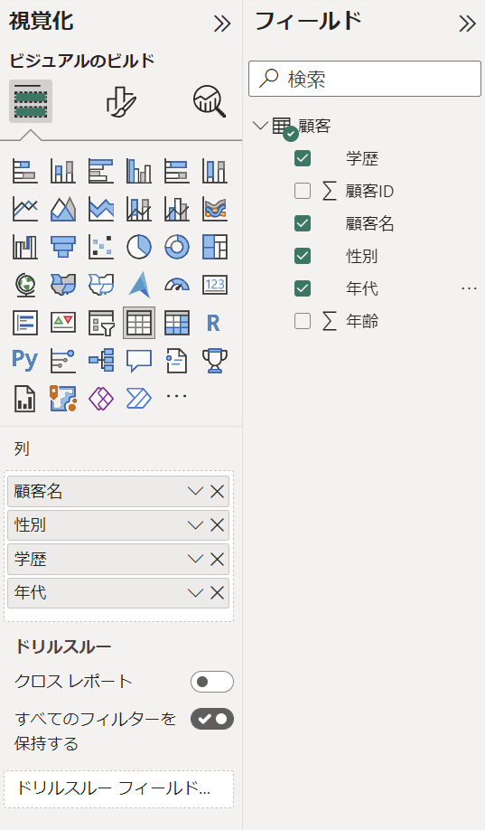

- 選択した項目が表形式を表示

  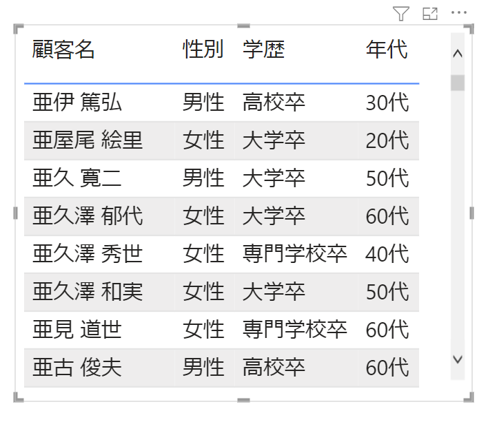

- ドラッグして大きさを調整

<br />

### メジャーの追加 (1)

- 画面右の「**データ**」をクリック

  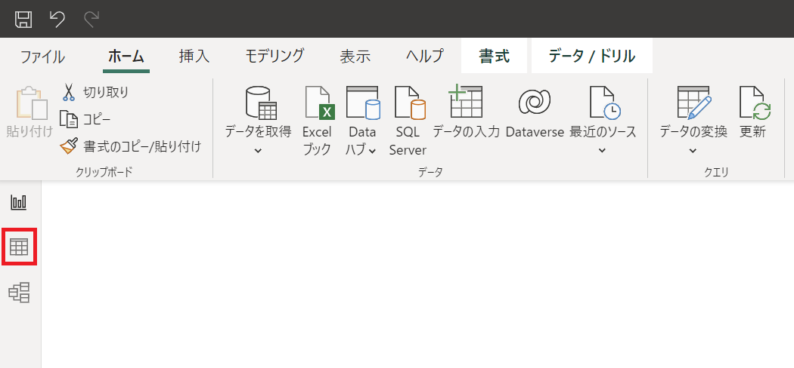

- 「**新しいメジャー**」をクリック

  

- 「**数式バー**」に式を入力

   ```
   総人数 = COUNTROWS('顧客') 
   ```

- 「**書式設定**」の「**，**」をクリック

  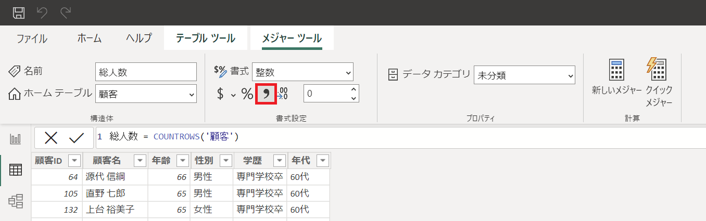

<br />

### カードの追加

- 画面右の「**レポート**」をクリック

  

- 「**視覚化**」の「**カード**」をクリック

  

- フィールド リストの「**顧客**」から「**総人数**」を「**フィールド**」を指定

  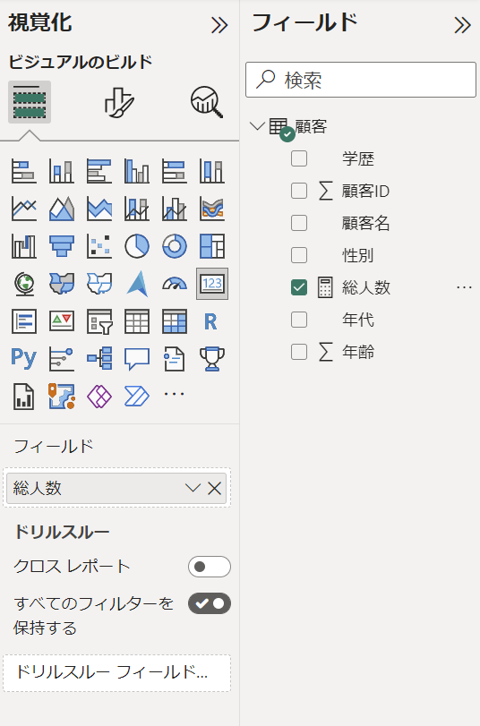

- レポートに顧客の総人数を表示

  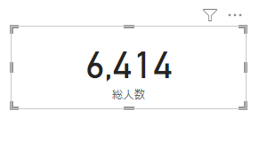

- ドラッグして大きさを調整

<br />

### 円グラフの追加

- 「**視覚化**」の「**円グラフ**」をクリック

  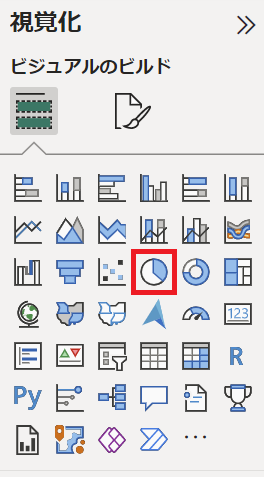

- フィールド リストの「**顧客**」から「**年代**」を「**凡例**」に、「**総人数**」を「**値**」を指定

  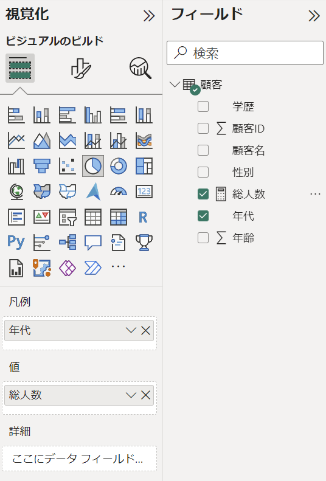

- 「**ビジュアルの書式設定**（）」を選択

- 「**詳細ラベル**」-「**オプション**」の「**ラベルの内容**」を「**全体に対する割合**」に変更

  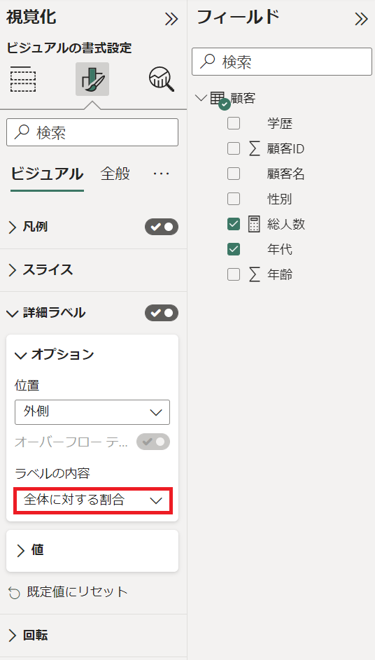

- レポートに円グラフで顧客の年代比率を表示

  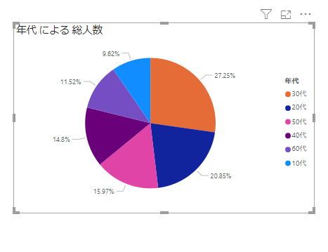

- 「...」をクリックし、「**軸の並べ替え**」-「**年代**」を選択し、年代順の表示に変更

  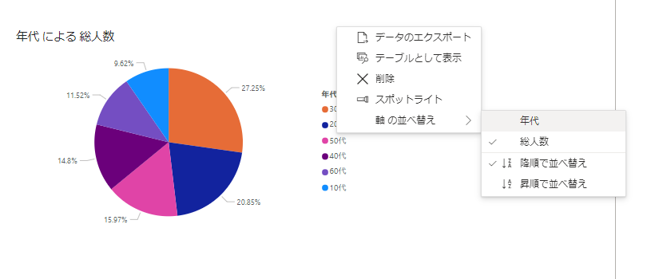

  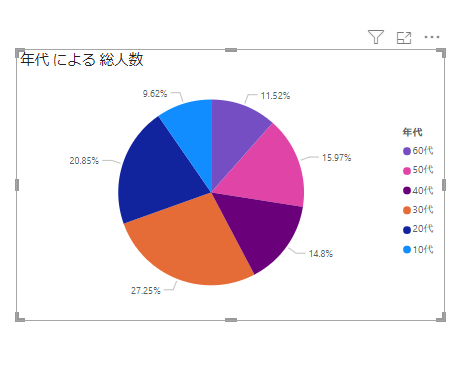

- ドラッグして大きさを調整

<br />

### ツリー マップの追加

- 「**視覚化**」の「**ツリー マップ**」をクリック

  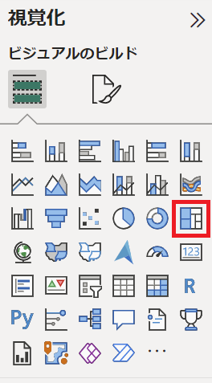

- フィールド リストの「**顧客**」から「**性別**」を「**カテゴリ**」に、「**総人数**」を「**値**」を設定

  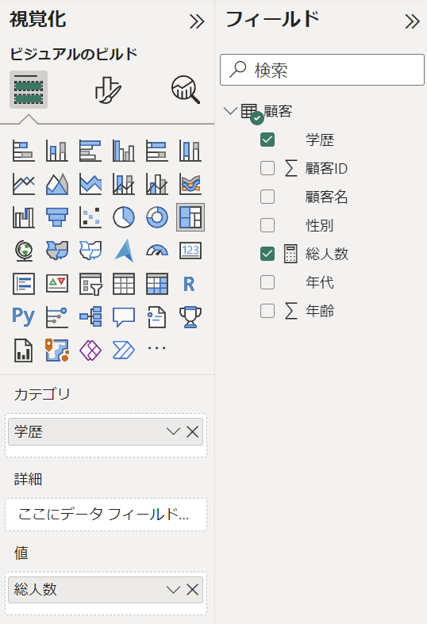

- レポートにツリー マップで学歴を表示

  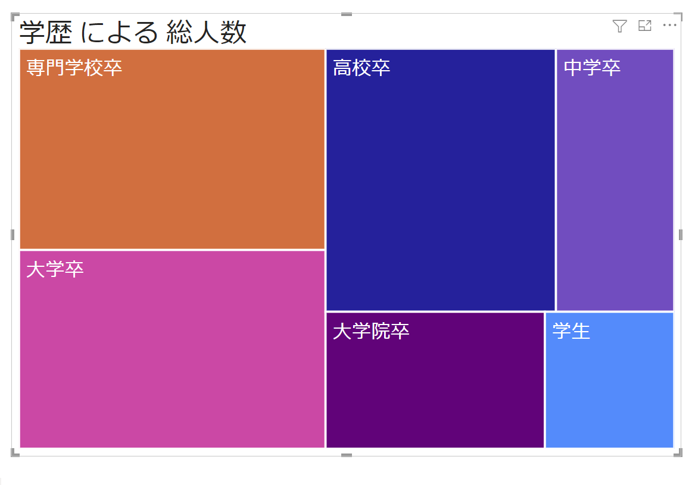

- ドラッグして大きさを調整

<br />

### マトリックスの追加 (1)

- 「**視覚化**」の「**マトリックス**」をクリック

  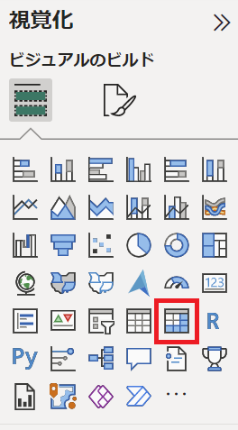

- フィールド リストの「**顧客**」から「**年代**」を「**行**」、「**総人数**」を「**値**」に指定

  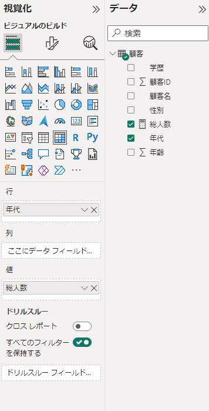

- レポートにマトリックスで年代ごとの人数を表示

  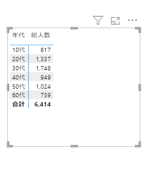

<br />

### メジャーの追加 (2)

- 画面右の「**データ**」をクリック

  

- 「**新しいメジャー**」をクリック

  

- 「**数式バー**」に式を入力

  ```
  人数比 = DIVIDE([総人数], CALCULATE([総人数], REMOVEFILTERS()))
  ```

- 「**書式設定**」の「**％**」をクリック

  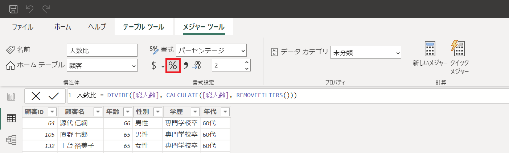

<br />

### マトリックスの更新 (1)

- 画面右の「**レポート**」をクリック

  

- 先の手順で追加したマトリックスを選択

- 「**値**」に「**人数比**」をドラッグして配置

  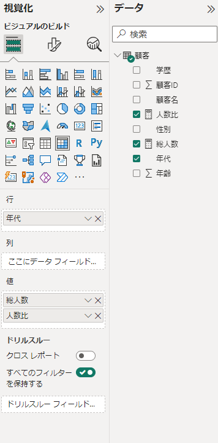

- マトリックスに人数比が追加

  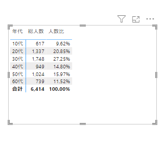

- 「**列**」に「**年代**」をドラッグして配置

  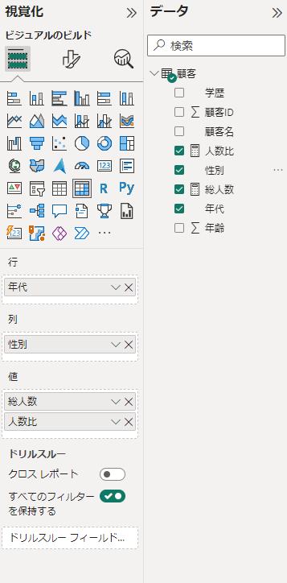

- 性別ごとに年代別の人数と総人数からの比率を表示

  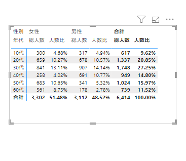

- ドラッグして大きさを調整

<br />

### メジャーの追加 (3)

- 画面右の「**データ**」をクリック

  

- 「**新しいメジャー**」をクリック

  

- 「**数式バー**」に式を入力

  ```
  総人数 ％ 年代 = DIVIDE([総人数], CALCULATE([総人数], REMOVEFILTERS('顧客'[年代])))
  ```

- 「**書式設定**」の「**％**」をクリック

  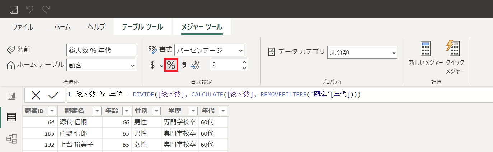

<br />

### マトリックスの更新 (2)

- 画面右の「**レポート**」をクリック

  

- 先の手順で追加したマトリックスを選択

- 「**値**」の「**人数比**」を削除し、「**総人数 % 年代**」をドラッグして配置

  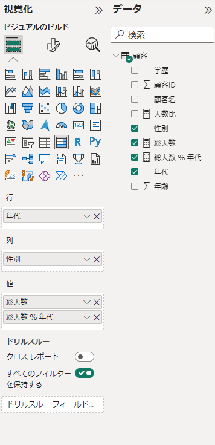

- マトリックスに性別内での年代比率を追加

  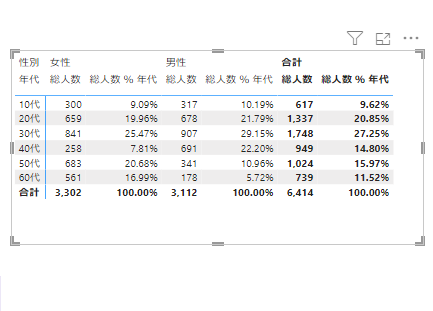

- ドラッグして大きさを調整

<br />

### メジャーの追加 (4)

- 画面右の「**データ**」をクリック

  

- 「**新しいメジャー**」をクリック

  

- 「**数式バー**」に式を入力

  ```
  総人数 % 学歴 = DIVIDE([総人数], CALCULATE([総人数], REMOVEFILTERS('顧客'[学歴]))) 
  ```
- 「**書式設定**」の「**％**」をクリック

  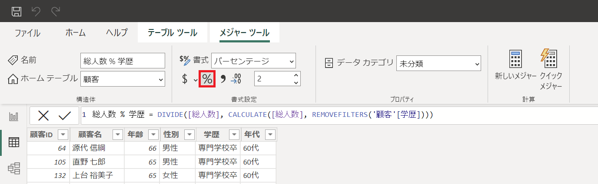

- 画面右の「**モデル**」をクリック

  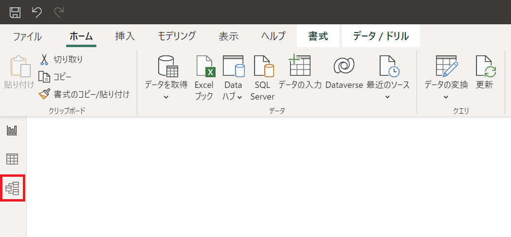

- フィールド リストの「**顧客**」から「**人数比**」を「**総人数**」、「**総人数 % 学歴**」、「**総人数 % 年代**」を選択

  「**フォルダーの表示**」に **Measures** と入力

  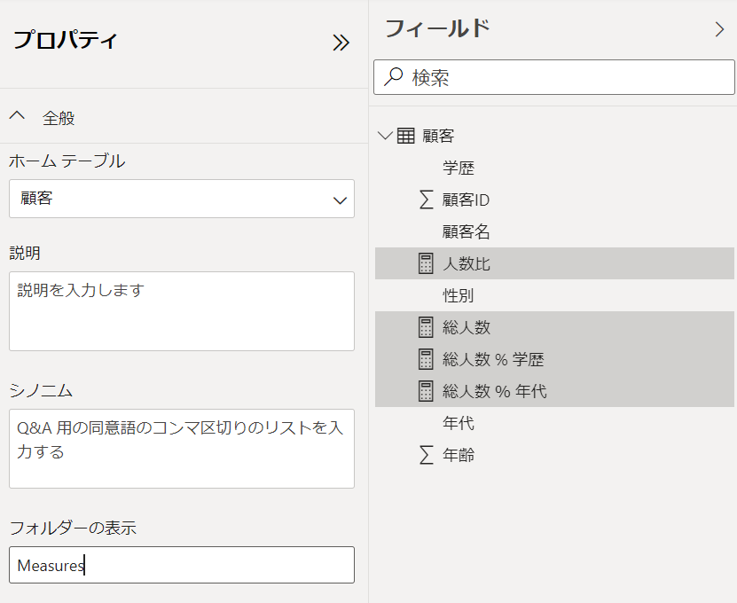

- 追加したメジャーを「**Measures**」フォルダーに整理

  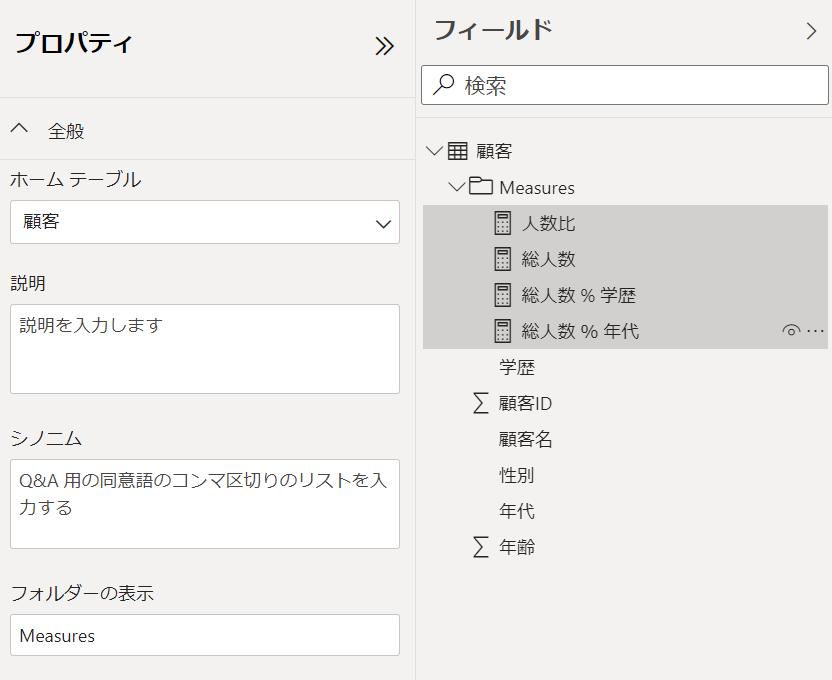

<br />

### マトリックスの追加 (2)

- 「**視覚化**」の「**マトリックス**」をクリック

  

- フィールド リストの「**顧客**」から「**学歴**」を「**行**」に、「**性別**」を「**列**」,「**総人数**」,「**総人数 % 学歴**」,「**人数比**」を「**値**」に指定

  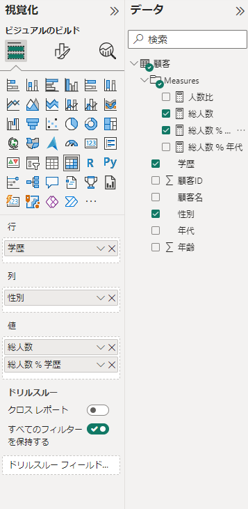

- 指定した内容でレポートにマトリックスが追加

  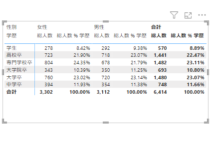

- ドラッグして大きさを調整

<br />

### 完成したレポート

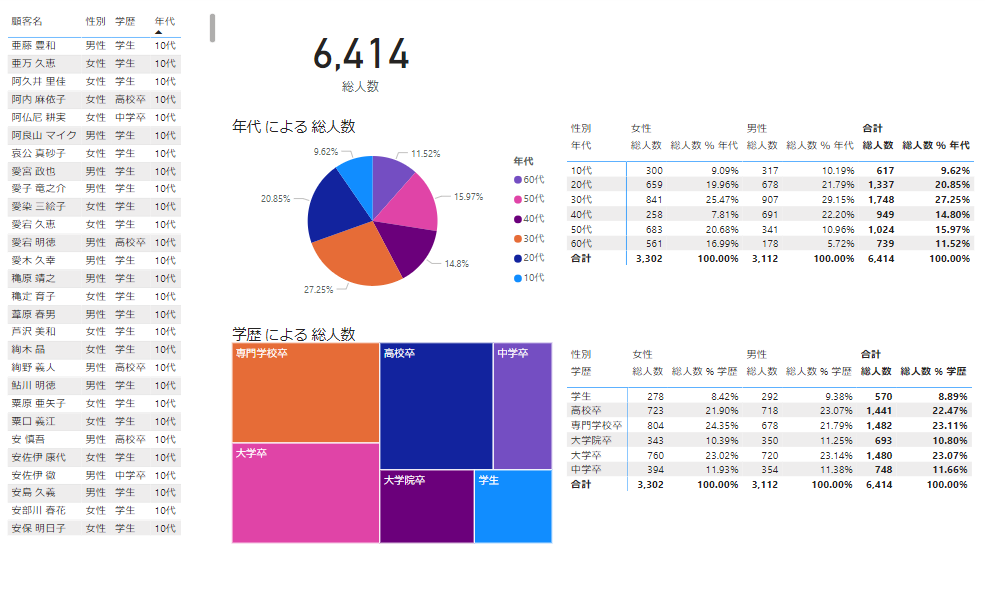

<br />

※ レポート内をクリックすると、クリックした項目でフィルタリング

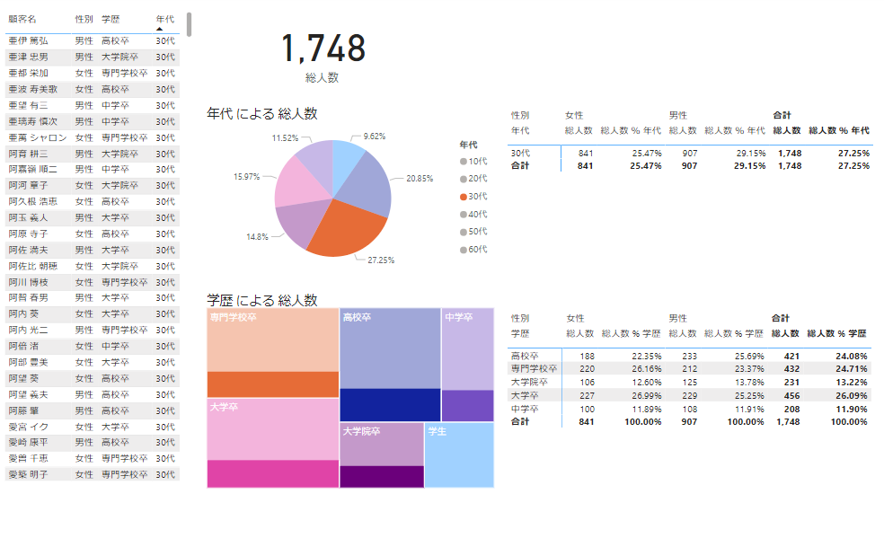

<br />
