# Power BI Hands-on training 

<br />

### **INDEX**

- [CSV ファイルからデータを読み込み](#csv-ファイルからデータを読み込み)

- [レポートへの折れ線グラフの追加](#レポートへの折れ線グラフの追加)

- [Excel ファイルからデータを読み込み](#excel-ファイルからデータを読み込み)

- [日付テーブルの追加](#日付テーブルの追加)

- [データモデルの更新](#データモデルの更新)

- [レポートの更新](#レポートの更新)

- [メジャーの追加](#メジャーの追加)

- [新しいページの追加](#新しいページの追加)

- [スライサーの追加](#スライサーの追加)

- [カードの追加](#カードの追加)

- [マップの追加](#マップの追加)

- [マトリックスの追加](#マトリックスの追加)

<br />

## オープンデータを利用したレポート作成

### CSV ファイルからデータを読み込み

- Power BI Desktop を起動

- 「**データを取得**」をクリックし、「**テキスト/CSV**」をクリック

  

- 「**newly_confirmed_cases_daily.csv**」を選択し、「**開く**」をクリック

- **元のファイル**、**区切り記号**、**データ型検出** を設定し、「**データの変換**」をクリック

  - **元のファイル**： 65001: Unicode (UTF-8)

  - **区切り記号**： コンマ

  - **データ型検出**： 最初の 200 行に基づく

    

- Power Query エディターが起動

  

- 「**Date**」列を選択し、「**変換**」タブに切り替え、「**データ型**」-「**日付**」を選択

  

- 「**新規手順の追加**」をクリック

  

- 「**Prefecture**」列の「**▼**」をクリック、「**ALL**」のチェックを外し「**OK**」をクリック

  

- 「**適用したステップ**」に行った操作を記録

  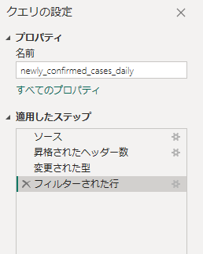

  ※ 次回以降ファイルを読み込む際も同様のステップが適用

- 「**ホーム**」タブに切り替え、「**閉じて適用**」をクリック

  

- フィールド リストに読み込んだデータが追加

  

<br />

### レポートへの折れ線グラフの追加

- 「**視覚化**」の「**折れ線グラフ**」をクリック

  

- フィールド リストの「**X 軸」に「**Date**」を「**Y 軸**」に「**Newly confirmed cases**」をドラッグして配置

  

- レポート上の折れ線グラフをドラッグして大きさを調整

  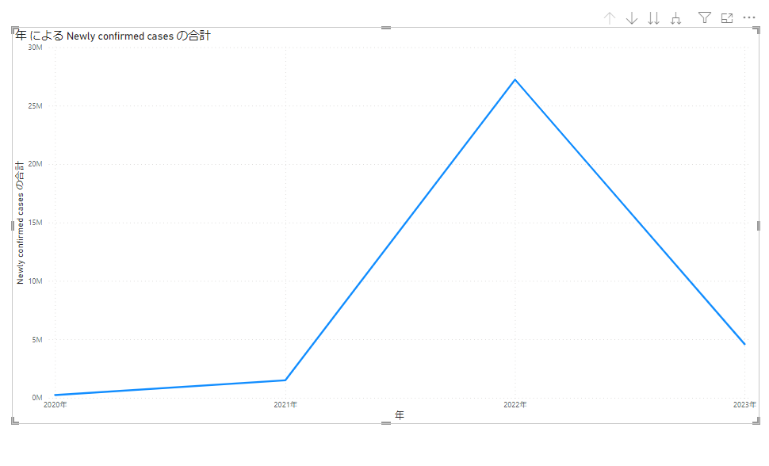

- フィールド リストの「**Date**」-「**日付の階層**」を展開

  「**X 軸**」に「**月**」、「**Y 軸**」に「**Newly confirmed cases**」、「**凡例**」に「**年**」をドラッグして配置

  

- 「**ビジュアルの書式設定**（）」を選択

- 「**行**」の「**色**」を展開し、凡例に指定した年の色を指定

- 「**マーカー**」をオンに設定

  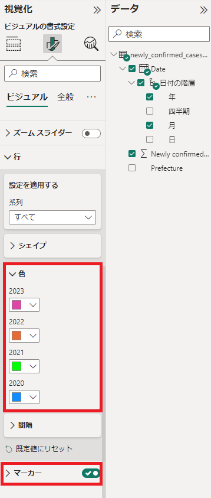

- 折れ線グラフが更新されたことを確認

  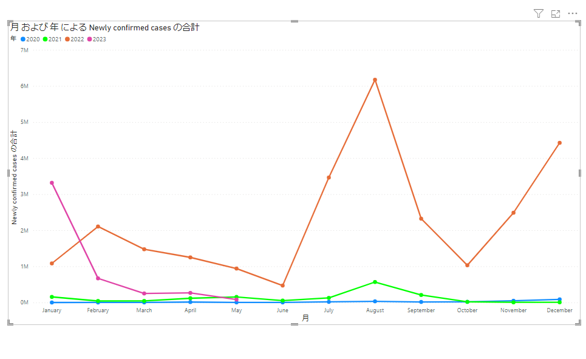

<br />

### Excel ファイルからデータを読み込み

- 「**データを取得**」をクリックし、「**Excel ブック**」をクリック

  

- 「**都道府県.xlsx**」を選択し、「**開く**」をクリック

- 「**都道府県マスタ**」を選択し、「**データの変換**」をクリック

  

- Power Query エディターが起動

  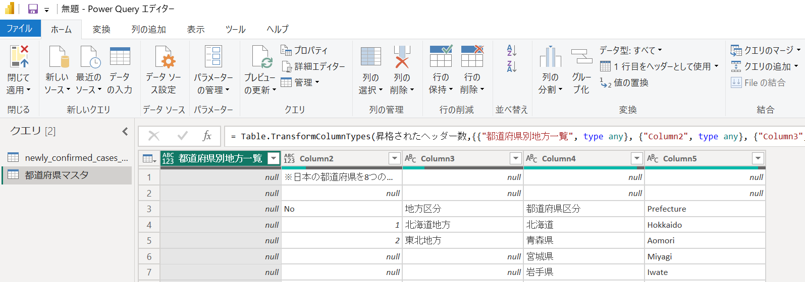

- 「**行の削除**」-「**上位の行の削除**」を選択

  

- 「**行数**」に「**2**」を入力し「**OK**」をクリック

  

- 「**都道府県別地方一覧**」列を選択、「**列の削除**」-「**列の削除**」を選択

  

- 「**1 行目をヘッダーとして使用**」を選択し、1 行目を列名に昇格

  

- 「**No**」と「**地方区分**」列を選択、「**変換**」タブの「**フィル**」-「**下**」をクリックし空白行を上位の行の値で穴埋め

  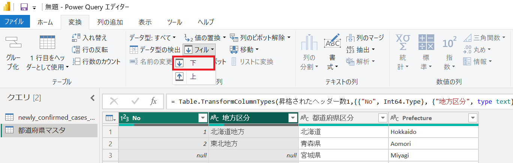

  

- 「**列の追加**」タブに切り替え、「**インデックス列**」-「**1 から**」をクリック

  

- 追加された「**インデックス**」列を右クリックし「**名前の変更**」を選択

  

- 列名を「**都道府県No**」に変更

- 同様の手順で「**No**」列の名前を「**地方区分No**」に変更

- 「**都道府県No**」列をドラッグして一番左に配置

  

- 「**適用したステップ**」に行った操作が記録されていることを確認

  

- 「**ホーム**」タブの「**閉じて適用**」をクリック

  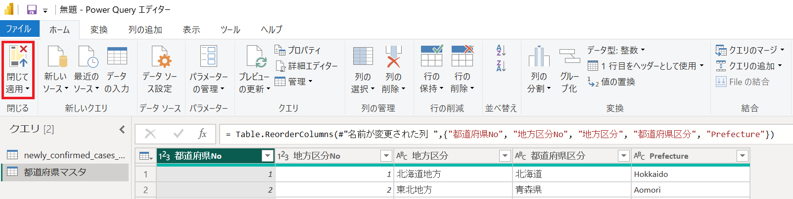

- フィールド リストに読み込んだデータが追加

  

<br />

### 日付テーブルの追加

- 画面右の「**データ**」をクリック

  

- 「**新しいテーブル**」をクリック

  

- 数式バーに CALENDAR 関数を入力し、「**日付マスタ**」の名前で 2020 年から 2022 年までの日付でテーブルを作成

  ```
  日付マスタ = CALENDAR("2020/1/1", "2022/12/31")
  ```

- テーブルに指定した期間の日付で「** Date**」列が追加されることを確認

  

- 「**新しい列**」をクリック

  

- 数式バーに YEAR 関数を入力し、「**年**」列を追加

  ```
  年 = YEAR('日付マスタ'[Date]) & "年" 
  ```

  
  
- 同様の手順で関数を使用し、以下５つの列を追加

  ```
  月 = FORMAT('日付マスタ'[Date], "MM月")
  ```

  ```
  曜日No = WEEKDAY('日付マスタ'[Date])
  ```

  ```
  曜日 = SWITCH(WEEKDAY('日付マスタ'[Date]), 1, "日曜日", 2, "月曜日", 3, "火曜日", 4, "水曜日", 5, "木彫日", 6, "金曜日", "土曜日")
  ```

  ```
  半期No = IF(MONTH('日付マスタ'[Date]) < 7, 1, 2)
  ```

  ```
  半期 = IF(MONTH('日付マスタ'[Date]) < 7, "上半期", "下半期") 
  ```

  「**月**」「**曜日No**」「**曜日**」「**半期No**」「**半期**」列をテーブルに追加

  

- 「**曜日**」列を選択、「**列で並べ替え**」-「**曜日No**」をクリック

  

- 「**半期**」列を選択、「**列で並べ替え**」-「**半期No**」をクリック

  

- 「**テーブル ツール**」タブの「**日付テーブルとしてマークする**」を選択

  

- 「**日付列**」に「**Date**」列を指定し「**OK**」をクリック

  

### データモデルの更新

- データ リストから「**都道府県マスタ**」を選択

- 「**地方区分**」列を選択、「**列で並べ替え**」-「**地方区分No**」を選択

  

- 「**都道府県区分**」列を選択、「**列で並べ替え**」-「**都道府県No**」を選択

  

- 画面右の「**モデル**」をクリック

  

- 「**日付マスタ**」テーブルの「**Date**」列を「**newly_confirmed_cases_daily**」テーブルの「**Date**」列にドラッグ

- 「**日付マスタ**」と「**newly_confirmed_cases_daily**」テーブルのそれぞれの Date 列を関連付け

  

- 「**リレーションシップの管理**」をクリック

  

- 各テーブル間のリレーションシップを確認

  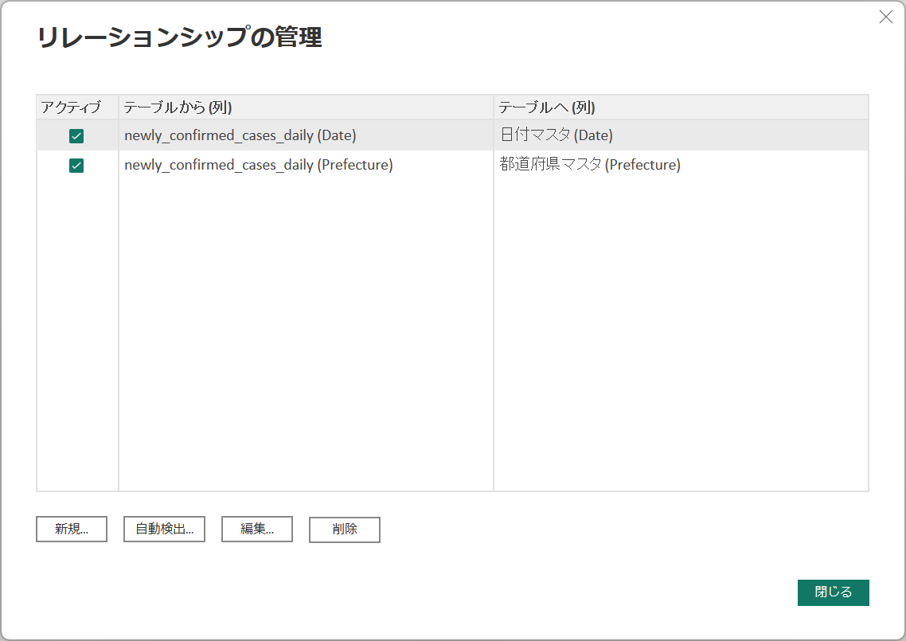

  ※ 「**都道府県マスタ**」と「**newly_confirmed_cases_daily**」テーブル間には自動的にリレーションシップが作成

- 「**日付マスタ**」の「**年**」列を選択し「」をクリックし、「**階層の作成**」を選択

  

- 「**日付マスタ**」に階層が追加

  

- 「**半期**」列を選択し「」をクリック、「**階層に追加**」-「**年 階層**」を選択

  

- 同様の手順で「**月**」列を階層に追加

  

- 追加した階層を選択、「**プロパティ**」パネルで名前を「**日付階層**」に変更

  

- 「**半期No**」列を選択、「**プロパティ**」パネルで「**非表示**」を「**はい**」に変更

  

- 同様の手順で「**曜日No**」も非表示に変更

- フィールド リストで指定した内容を確認

  

- フィールド リストで「**都道府県マスタ**」を選択

- 「**地方区分No**」、「**都道府県No**」を非表示に設定

  

<br />

### レポートの更新

- 画面右の「**レポート**」を選択

  

- ページ上の折れ線グラフを選択

  

- 「**X 軸**」の「**Date**」を「**×**」をクリックして削除

  

- 「**X 軸**」に「**日付マスタ**」の「**月**」列を、「**Y 軸**」に「**年**」列をドラッグして配置

  

- ページ上の折れ線グラフの「…」をクリック、「**軸の並べ替え**」-「**月**」を選択

  

- 同じ手順で「**軸の並べ替え**」-「**昇順で並べ替え**」を選択

- 月ごとの感染者数を年別に表現

  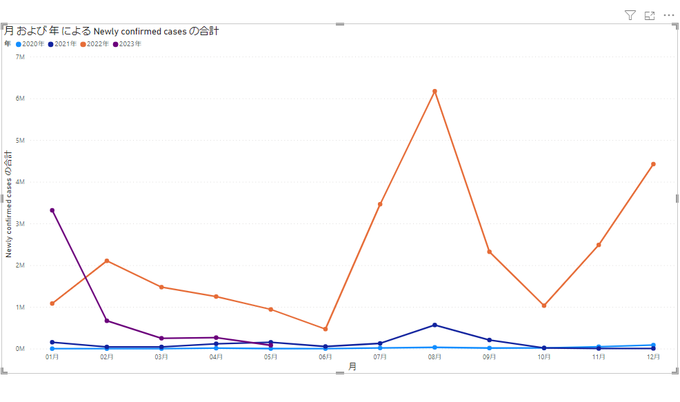

- 「**スモール マルチプル**」に「**都道府県マスタ**」-「**地方区分**」をドラッグして配置

  

- 「**ビジュアルの書式設定**（）」を選択

- 「**スモール マルチプル**」を展開し、「**レイアウト**」の「**列**」を **４** に変更

  

- 地方ごとにグラフを分割して表示

  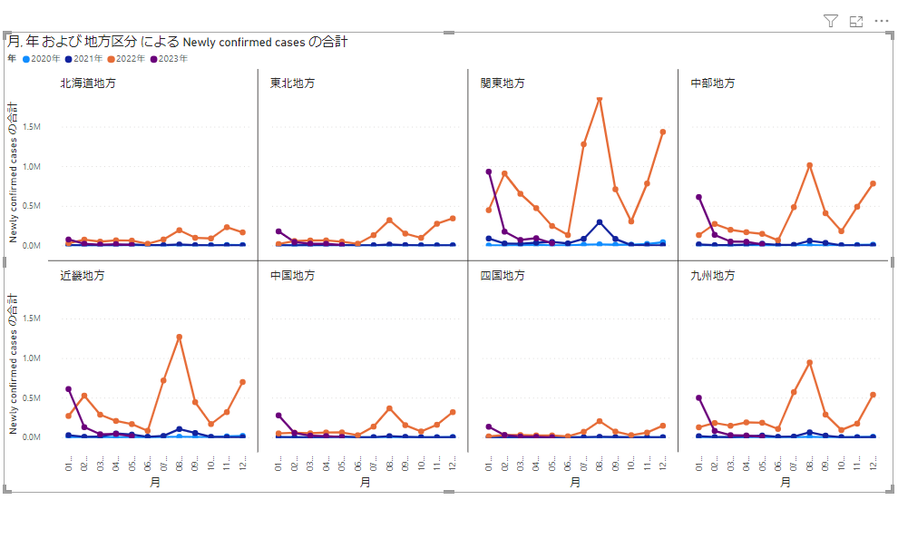

<br />

### メジャーの追加

- 画面右の「**データ**」をクリック

  

- データ リストから「**newly_confirmed_cases_daily**」を選択

- 「**新しいメジャー**」をクリック

  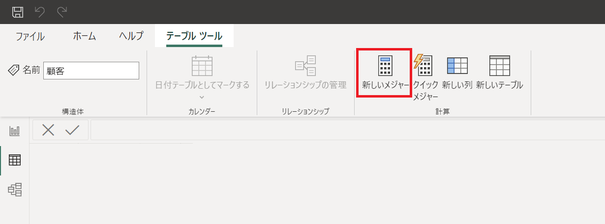

- 「**数式バー**」に式を入力

  ```
  Total = SUM(newly_confirmed_cases_daily[Newly confirmed cases])
  ```

- 「**書式設定**」の「**,**」をクリック

  

- 再度、「**新しいメジャー**」をクリックし、前月比を算出するメジャーを追加

  ```
  MoM% = DIVIDE('newly_confirmed_cases_daily'[Total], CALCULATE('newly_confirmed_cases_daily'[Total], DATEADD('日付マスタ'[Date], -1, MONTH))) - 1
  ```

- 「**書式設定**」の「**％**」をクリック

  

- 画面右の「**モデル**」をクリック

  

- フィールド リストの「**newly_confirmed_cases_daily**」配下の「**Total**」、「**MoM%**」を選択

- プロパティ パネルの「**フォルダーの表示**」に **Measures** と入力

  

- 作成したメジャーを **Measures** フォルダに整理

  

<br />

### 新しいページの追加

- 画面右の「**レポート**」をクリック

  

- 左下の「**＋**」をクリックしてページを追加

  

<br />

### スライサーの追加

- 「**視覚化**」の「**スライサー**」をクリック

  

- 「**フィールド**」に「**日付マスタ**」の「**年**」をドラッグして配置

  

- 「**ビジュアルの書式設定**（）」を選択

- 「**スライサーの設定**」-「**オプション**」を展開し、「**スタイル**」を「**タイル**」に変更

  「**スライサー ヘッダー**」をオフに設定

  

- ページ上でスライサーの大きさを１行にすべての項目が表示されるよう調整

  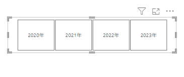

- 「**視覚化**」の「**スライサー**」をクリック

  

- 「**フィールド**」に「**都道府県マスタ**」の「**地方区分**」をドラッグして配置

  

- 「**ビジュアルの書式設定**（）」を選択

- 「**スライサーの設定**」-「**オプション**」を展開し、「**スタイル**」を「**タイル**」に変更

  「**スライサー ヘッダー**」をオフに設定

  

- ページ上でスライサーの大きさを１行にすべての項目が表示されるよう調整

- ドラッグして先の手順で作成したスライサーの左に表示されるよう移動

  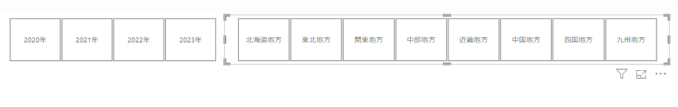

- 「**ビジュアルの書式設定**（）」を選択

- 「**値**」を展開

  「**値**」の「**フォントの色**」、「**背景**」の「**色**」を任意の色に変更

  

- ページ上のスライサーに変更が反映

  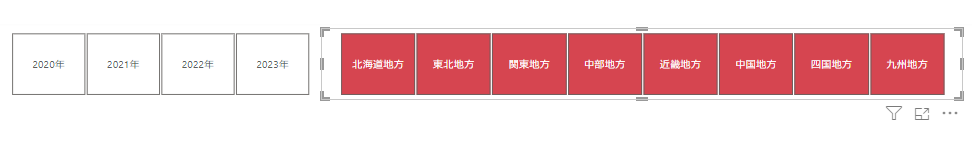

<br />

### カードの追加

- 「**視覚化**」の「**カード**」をクリック

  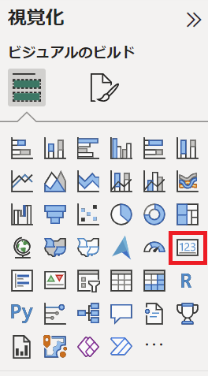

- フィールド リストの「**newly_confirmed_cases_daily**」から「**フィールド**」に「**Total**」をドラッグして配置

  

- 「**ビジュアルの書式設定**（）」を選択

- 「**吹き出しの値**」-「**表示単位**」を「**なし**」に変更

  

- 大きさを調整し、年スライサーの下に表示されるようドラッグして移動

  

<br />

### マップの追加

- 「**視覚化**」の「**マップ**」をクリック

  

- 「**場所**」に「**都道府県区分**」、「**バブル サイズ**」に「**Total**」をドラッグして配置

  

- 「**ビジュアルの書式設定**（）」を選択

- 「**全般**」の「**タイトル**」をオフに設定

  

- 大きさを調整し、カードの下に表示されるようドラッグして移動

  

<br />

### マトリックスの追加

- 「**視覚化**」の「**マトリックス**」をクリック

  

- 「**行**」に「**都道府県区分**」、「**列**」に「**月**」、「**値**」に「**Total**」を指定

  

- 「**Total**」の「」をクリック

  「**条件付き書式**」-「**背景色**」を選択

  

- 条件付き書式の設定を行い「**OK**」をクリック

  - **データ形式スタイル**： グラデーション

  - **適用先**： 値のみ

  - **基準にするフィールド**： Total

  - **からの値を書式設定する方法**： ゼロとして

  - **最小値**： 任意の色（例は #ffffff を選択）

  - **最大値**： 任意の色（例は #e68f96 を選択）

    

- 大きさを調整し、地方区分スライサーの下に表示されるようドラッグして移動

  

<br />

### 完成したレポート

- ページ１

  

- ページ２

  

  ※ スライサーの項目をクリックしてフィルタリング

  

<br />