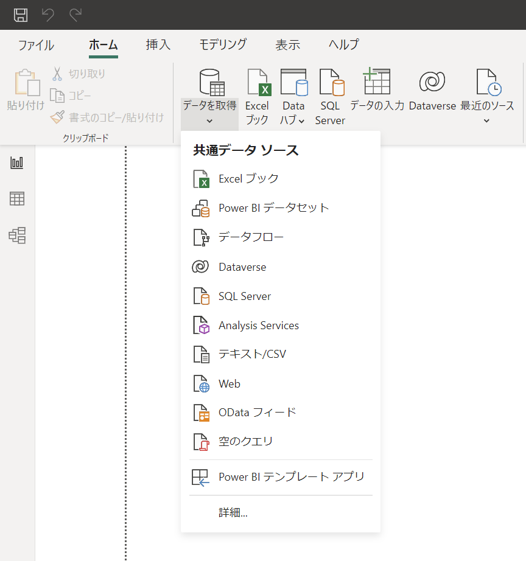
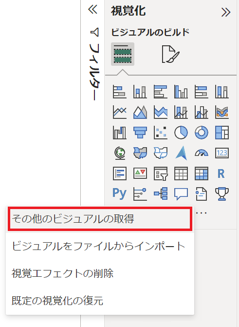
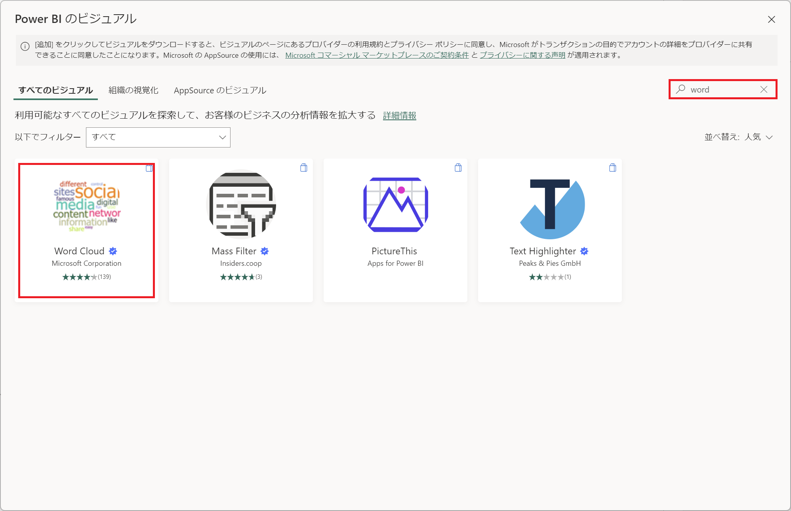
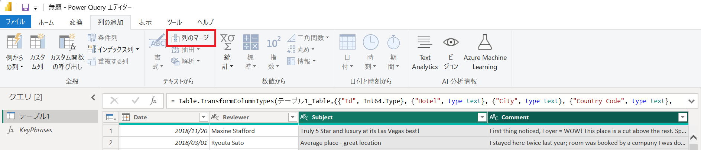
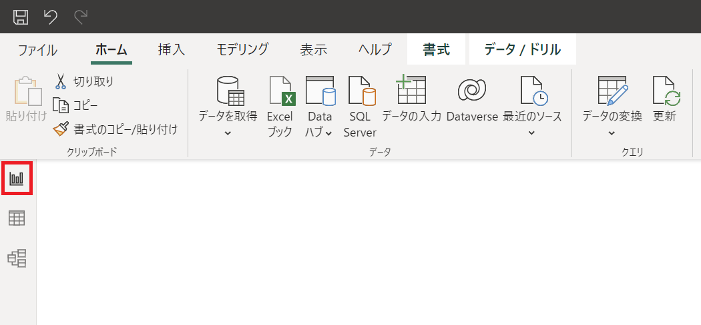
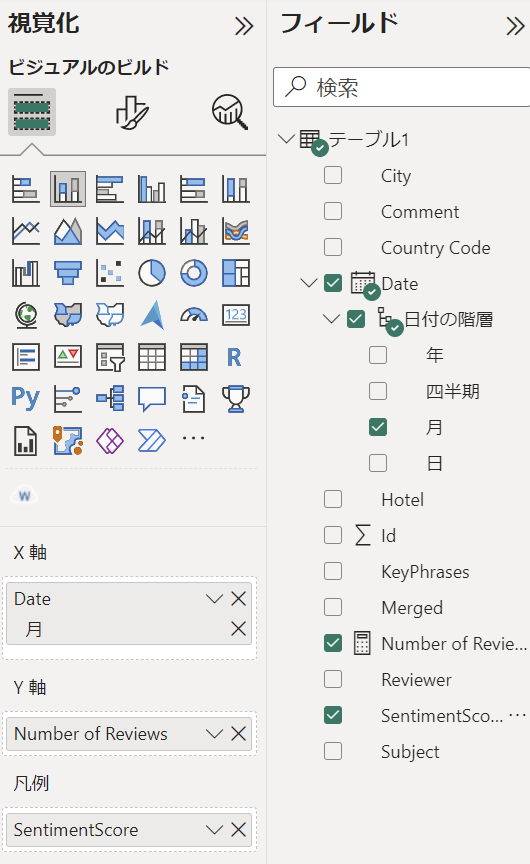
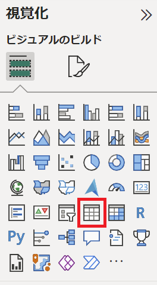
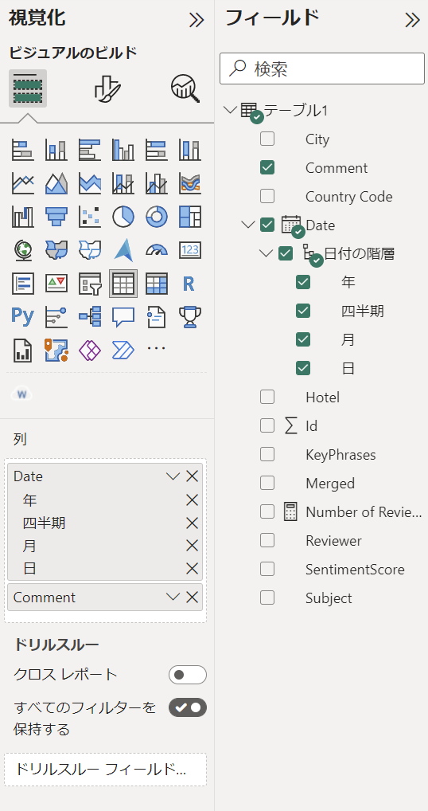
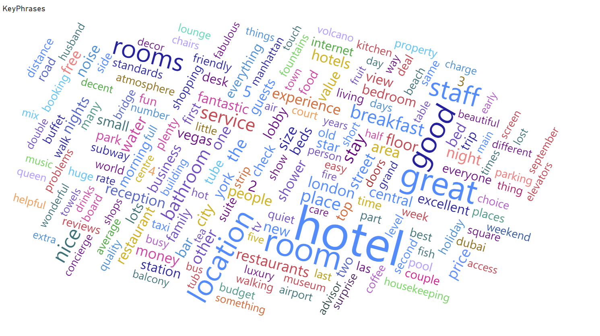
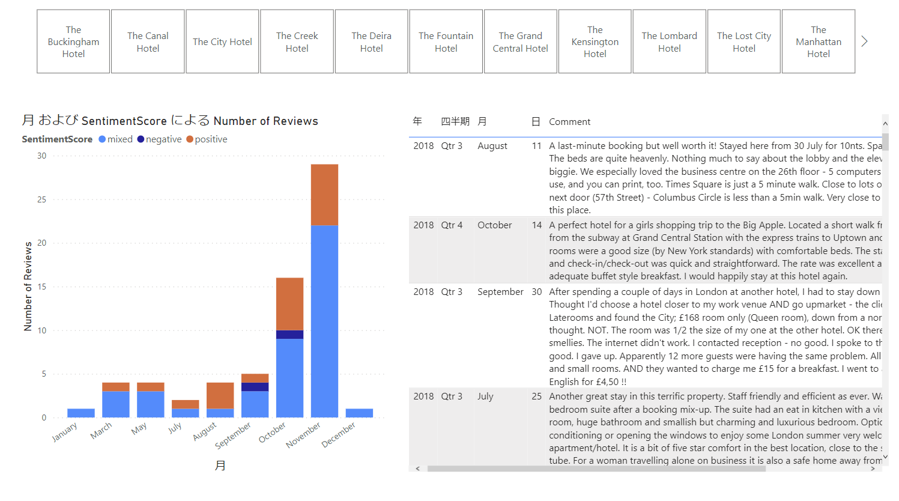

# Power BI Hands-on training 

<br />

### **INDEX**

- [Excel ファイルからデータを読み込み](#excel-ファイルからデータを読み込み)

- [Word Cloud のインポート](#word-cloud-のインポート)

- [Word Cloud の追加](#word-cloud-の追加)

- [言語サービスを使用したキーフレーズの抽出](#言語サービスを使用したキーフレーズの抽出)

- [レポートの更新](#レポートの更新)

- [言語サービスを使用した感情分析](#言語サービスを使用した感情分析)

- [メジャーの追加](#メジャーの追加)

- [新しいページの追加](#新しいページの追加)

- [積み上げ縦棒グラフの追加](#積み上げ縦棒グラフの追加)

- [テーブルの追加](#テーブルの追加)

- [スライサーの追加](#スライサーの追加)

<br />

## AI を利用したレポート作成

### Excel ファイルからデータを読み込み

- 「**データを取得**」をクリックし、「**Excel ブック**」をクリック

  

- 「**reviews.xlsx**」を選択し、「**開く**」をクリック

- 「**テーブル1**」を選択し、「**読み込み**」をクリック

  

- フィールド リストに「**テーブル1**」が追加

  

<br />

### Word Cloud のインポート

- 「**視覚化**」の「**…**」をクリックし、「**その他のビジュアルの取得**」を選択

  

- 右上の検索ボックスに「**Word**」と入力

- 表示された検索結果から「**Word Cloud**」をクリック

  

- 「**追加する**」をクリック

  

- 正常にインポートされたことを確認し「**OK**」をクリック

  

<br />

### Word Cloud の追加

- 「**視覚化**」の「**Word Cloud**」をクリック

  

- 「**カテゴリ**」に「**テーブル1**」の「**Comment**」をドラッグして配置

  

- ページ一面に表示されるよう大きさを調整

  

  ※ Comment に記載された頻出単語を表示

<br />

### 言語サービスを使用したキーフレーズの抽出

- 「**ホーム**」タブの「**データの変換**」をクリック

  

- Power Query エディターが起動

  

- 「**新しいソース**」-「**空のクエリ**」を選択

  

- 画面右のクエリの設定で「**名前**」を「**KeyPhrases**」に変更

  

- 「**詳細エディター**」をクリック

  

- 「**詳細エディター**」が起動

  

- 式に以下のコードを記述

  ```
  (text) => let
      apikey      = "<YOUR_API_KEY>",
      endpoint    = "https://<YOUR_CUSTOM_DOMAIN>/text/analytics/v3.0/keyPhrases",
      jsontext    = Text.FromBinary(Json.FromValue(Text.Start(Text.Trim(text), 5000))),
      jsonbody    = "{ documents: [ { language: ""en"", id: ""0"", text: " & jsontext & " } ] }",
      bytesbody   = Text.ToBinary(jsonbody),
      headers     = [#"Ocp-Apim-Subscription-Key" = apikey],
      bytesresp   = Web.Contents(endpoint, [Headers=headers, Content=bytesbody]),
      jsonresp    = Json.Document(bytesresp),
      keyphrases  = Text.Lower(Text.Combine(jsonresp[documents]{0}[keyPhrases], ", "))
  in  keyphrases
  ```

  

  ※元の式は削除して貼り付け

- 「**apikey**」、「**endpoint**」を使用する Cognitive Services のキー、サービス エンドポイントへ変更

  「**完了**」をクリックし、詳細エディターを終了

- 画面左の「**テーブル1**」を選択

  

- 「**Subject**」列と「**Comment**」列を選択し、「**列の追加**」タブの「**列のマージ**」をクリック

  

- 「**列のマージ**」ダイアログで「**区切り記号**」と「**新しい列名**」を指定し「**OK**」をクリック

  - **区切り記号**： タブ

  - **新しい列名**： Merged

    

- 「**Merged**」列がテーブル1に追加

  

- 「**カスタム関数の呼び出し**」をクリック

  

- 「**カスタム関数の呼び出し**」ダイアログで「**新しい列名**」、「**関数クエリ**」、「**text**」を指定し「**OK**」をクリック

  - **新しい列名**： KeyPhrases

  - **関数クエリ**： KeyPhrases

  - **text**： Merged

    

- 「**接続情報を指定してください**」のメッセージが表示されるので、「**資格情報の編集**」をクリック

  

- 「**Web コンテンツへのアクセス**」ダイアログで「**匿名**」タブが選択されていることを確認し「**接続**」をクリック

  

- 「**データのプライバシーに関する情報が必要です**」のメッセージが表示されるので「**続行**」をクリック

  

- 「**プライバシー レベル**」ダイアログで「**パブリック**」を選択し「**保存**」をクリック

  

- 言語サービスによりキーワードが抽出された「**KeyPhrases**」列が追加

  

- 「**ホーム**」タブの「**閉じて適用**」をクリック

  

<br />

### レポートの更新

- ページ上の Word Cloud を選択

- 「**カテゴリ**」を「**テーブル1**」の「**KeyPhrases**」に変更

  

- Word Cloud 上の頻出単語が変更されることを確認

  

<br />

### 言語サービスを使用した感情分析

- 「**ホーム**」タブの「**データの変換**」をクリック

  

- Power Query エディターが起動

- 「**新しいソース**」-「**空のクエリ**」を選択

  

- 画面右のクエリの設定で「**名前**」を「**Sentiment**」に変更

  

- 「**詳細エディター**」をクリック

  

- 式に以下のコードを記述

  ```
  (text) => let
      apikey = "<YOUR_API_KEY>",
      endpoint = "https://<YOUR_CUSTOM_DOMAIN>/text/analytics/v3.1/sentiment",
      jsontext = Text.FromBinary(Json.FromValue(Text.Start(Text.Trim(text), 5000))),
  　  jsonbody = "{ documents: [ { language: ""en"", id: ""0"", text: " & jsontext & " } ] }",
  　  bytesbody = Text.ToBinary(jsonbody),
  　  headers = [#"Ocp-Apim-Subscription-Key" = apikey],
  　  bytesresp = Web.Contents(endpoint, [Headers=headers, Content=bytesbody]),
  　  jsonresp = Json.Document(bytesresp),
  　  sentiment   = jsonresp[documents]{0}[sentiment] 
  in sentiment
  ```

- **apikey** と **endpoint** を変更し「**完了**」をクリック

  

- 画面左で「**テーブル1**」を選択し、「**列の追加**」タブの「**カスタム関数の呼び出し**」をクリック

  

- 「**カスタム関数の呼び出し**」ダイアログで「**新しい列名**」、「**関数クエリ**」、「**text**」を指定し「**OK**」をクリック

  - **新しい列名**： SentimentScore

  - **関数クエリ**： Sentiment

  - **text**： Merged

    

- 「**SentimentScore**」列が追加されたことを確認

- 「**ホーム**」タブの「**閉じて適用**」をクリック

  

<br />

### メジャーの追加

- 画面右の「**データ**」をクリック

  

- 「**新しいメジャー**」をクリック

  

- 数式バーに以下を入力し、レビュー総数をカウントするメジャーを作成

  ```
  Number of Reviews = COUNTROWS('テーブル1')
  ```

- 「**書式設定**」の「**，**」をクリック

  

<br />

### 新しいページの追加

- 画面右の「**レポート**」をクリック

  

- 左下の「**＋**」をクリックしてページを追加

  

<br />

### 積み上げ縦棒グラフの追加

- 「**視覚化**」の「**積み上げ縦棒グラフ**」をクリック

  

- 「**X 軸**」、「**Y 軸**」にそれぞれフィール リストのフィールドを指定

  - **X 軸**： 「**テーブル1**」-「**Date**」-「**日付の階層**」-「**月**」

  - **Y 軸**： 「**テーブル1**」-「**Number of Reviews**」

    

- ページ上で積み上げ縦棒グラフの大きさを調整

  

  ※ 月ごとのレビュー数が縦棒グラフで表示

- 「**凡例**」に「**SentimentScore**」をドラッグして配置

  

- レビューを mixed, negative, positive と判別して表示

  

<br />

### テーブルの追加

- 「**視覚化**」の「**テーブル**」をクリック

  

- 「**列**」に「**テーブル1**」の「**Date**」と「**Comment**」をドラッグして配置

  

- 大きさを調整し、積み上げ縦棒グラフの右に移動

  

- 積み上げ縦棒グラフをクリックし、コメントをフィルタリングできることを確認

  

<br />

### スライサーの追加

- 「**視覚化**」の「**スライサー**」をクリック

  

- 「**フィールド**」に「**テーブル1**」の「**ホテル**」をドラッグして配置

  

- 「**スライサーの設定**」-「**オプション**」を展開し、「**スタイル**」を「**タイル**」に変更

  「**スライサー ヘッダー**」をオフに設定

  

- 大きさを調整し、ページ上部に配置

  

<br />

### 完成したレポート

- ページ１

  

- ページ２

  

  ※ ホテル名、SentimentScore でフィルタリングが可

  

<br />