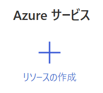

# Power-BI-Trainig-2

## 事前準備

### Power BI Desktop

- <a href="https://www.microsoft.com/ja-JP/download/details.aspx?id=58494">Power BI Desktop のダウンロード</a>

 

### リソース グループの作成

- Azure Portal にアクセス

- トップ ページの「**リソース グループ**」-「**＋ 作成**」をクリック

  

- **サブスクリプション**、**リソース グループ**、**リージョン** を指定し、「**確認および作成**」をクリック

  - **サブスクリプション**： 使用するサブスクリプションを選択

  - **リソース グループ**： リソース グループ名を入力

  - **リージョン**： 使用するリージョンを選択

    

- 指定した内容に問題がないことを確認し「**作成**」をクリック

 

### Cognitive Services の作成

- 「**リソースの作成**」をクリック

  

- 「**AI + Machine Learning**」を選択、「**Cognitive Services**」の「**作成**」をクリック

  

- 必要事項を指定し「**確認と作成**」をクリック

  - **サブスクリプション**： 先の手順で選択したサブスクリプションを選択

  - **リソース グループ**： 先の手順で作成したリソース グループを選択

  - **リージョン**： 使用するリージョンを選択

  - **名前**： 名前を入力

  - **価格レベル**： Standard S0 を選択

    

    ※ ネットワークと Identity は既定のままの設定で OK

- 指定した内容に問題がないことを確認し「**作成**」をクリック

  

 

### Cognitive Services のエンドポイントとキーの確認

- 作成した Cognitive Services の管理ブレードへ移動

- 「**キーとエンドポイント**」を選択

  

  ※ 演習で使用するキーとエンドポイントを確認

 
